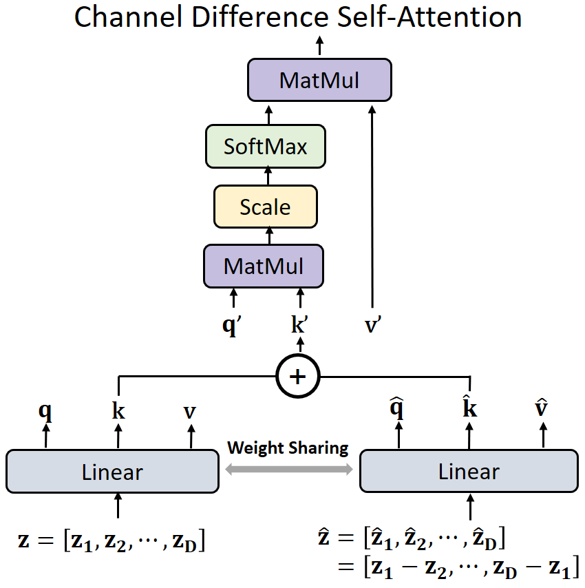
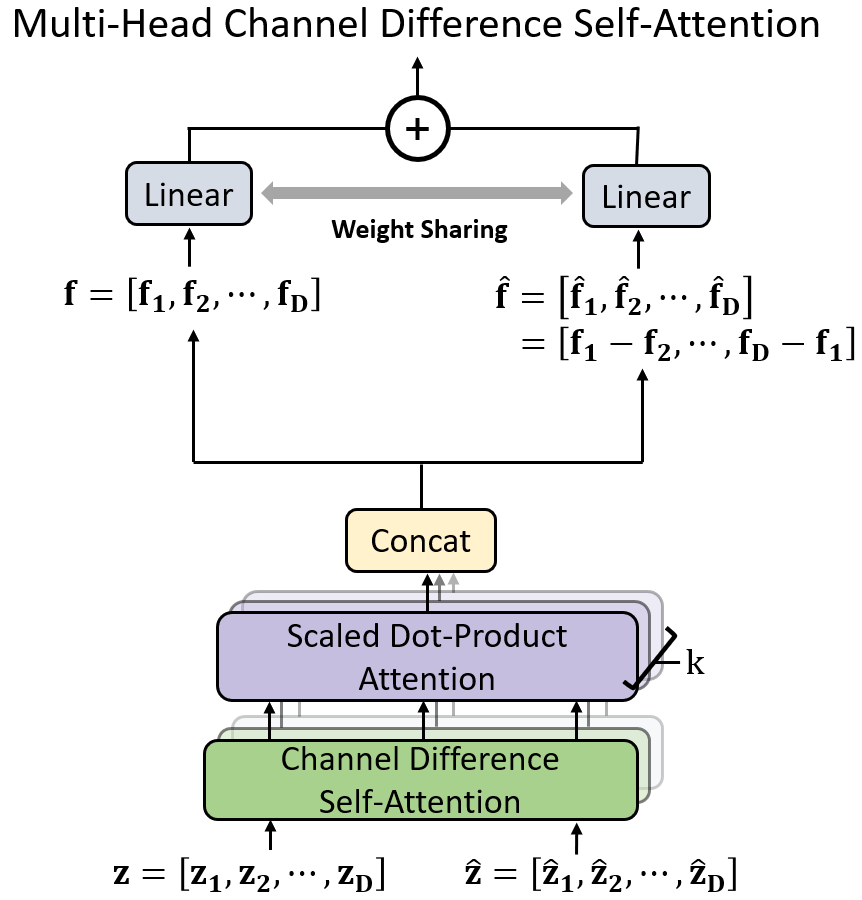

# CDformer

### Channel difference transformer for face anti-spoofing

This is the first work focusing on exploring  semantically complementary channel information  to enhance the discriminability of channel-wise features for face anti-spoofing. 

## Overview of the proposed Channel Difference Self-Attention (CDSA).



## Multi-Head Channel Difference Self-Attention (MCDSA) consists of k CDSA operations running in parallel.


## Requirements
```
numpy==1.23.3
pytz==2022.4
requests==2.28.1
scikit_learn==1.2.0
timm==0.6.7
torch==1.10.1
torchvision==0.11.2
```

## Training & Testing
Run `train.py` to train LDCformer

Run `test.py` to test LDCformer

## Citation

If you use the LDCformer/Decoupled-LDC, please cite the paper:
```
@article{huang2025channel,
  title={Channel difference transformer for face anti-spoofing},
  author={Huang, Pei-Kai and Chong, Jun-Xiong and Hsu, Ming-Tsung and Hsu, Fang-Yu and Hsu, Chiou-Ting},
  journal={Information Sciences},
  pages={121904},
  year={2025},
  publisher={Elsevier}
}
```
